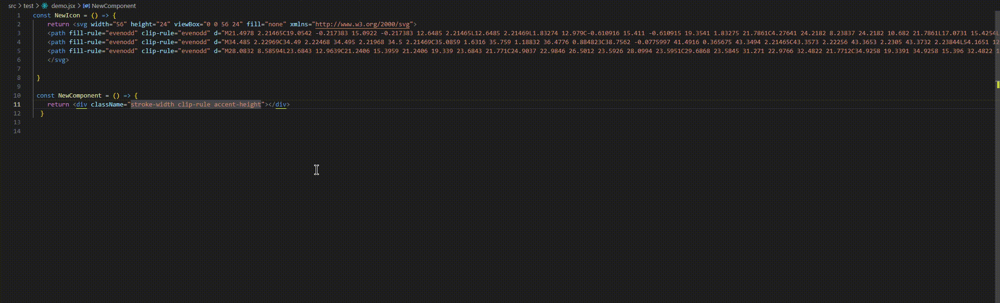

# SVG Attribute Converter

## Overview
The SVG Attribute Converter is a Visual Studio Code extension designed to transform SVG attributes from `kebab-case` to `camelCase` and format the code using Prettier.

## Demo

### Features
- This extension provides a command to convert specific SVG attributes from kebab-case to camelCase.
- Works exclusively in JSX and TSX files, ensuring that other file types remain unaffected.
- The extension supports a keyboard shortcut `Alt + Shift + F` (with higher priority for `format document` to run first).

## How to Use
1. Open a file containing SVG code.
2. Press `Alt + Shift + F` The extension will convert applicable attributes and format the code automatically.

## Release Notes
### 1.0.0
- Initial release with functionality to convert SVG attributes to `camelCase` and format with Prettier.